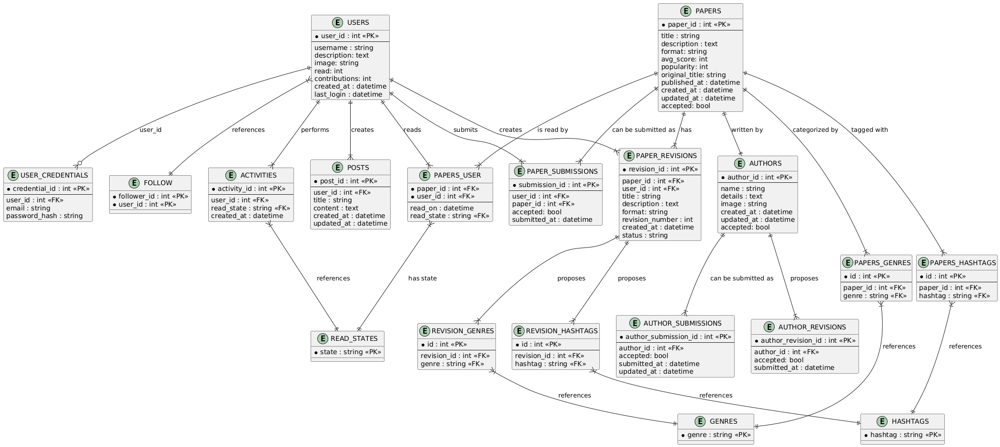

## Documentation for ScienceArch

#### Introduction
ScienceArch is web aplication, which will help users tract read scientific texts, search for new ones based on title or genres and rate them. It will also have a basic functionality to support community information exchange in form of posts, activity and user profiles. The idea is based on AniList, similar service used to search, trac and rate anime and manga.

Technologies used:
- Haskell
- MariaDB
- HTMX + Tailwind
- Nix

### Users
This application is mainly for students and scientific workers.

There are two types of users, normal users and admins. Admins will be able to delete posts and accecpt submissions of new texts into platform.

Users will be able to mark texts as read, reading or plan to read. Beside that, user can change his profile description and send posts. On top of that, users could follow eachother and submit new texts to the platform.

### Developer enviorment
The database used for this project is MariaDB. It is deployed using docker container. 

For project dependencies and build the nix is used. It is wide ecosystem, providing both biggest and latest package manager as well as developer enviorments and build system.

To enter developer enviorment and start database container:
```bash
# Enter nix shell - the developer enviorment
nix-shell --run bash

# Enable the docker daemon
sudo dockerd &

# Compose docker container
sudo docker-compose up -d

# Ensure it works
sudo docker-compose ps

# Enter the DB directly - for debug purpouses
sudo docker-compose exec db mariadb -u admin -p papers_db
```

Compile and run:
```bash
bash build.sh
```

### Functionalities
#### General
1. See home -> Activity + Posts + Reading

#### User related
1. Register as user
2. See profile
3. Login
4. Logout
5. List users
6. See profile of others
7. Follow user
8. Make post

#### User Paper
1. Submit paper - with genres
2. Resubmit paper - with genres
3. Read paper

#### User Author
1. Submit author
2. Resubtmi author
3. Author Paper

#### Admin
1. Accept submit paper
2. Accept submit author
3. Accept resubmit paper
4. Accept resubmit author

### Subsites
1. Home -> 20 latest activities or posts, 5 articles that user is reading, 
2. /users/<username> - same goes for seeing your profile
3. Your reading list -> /users/<username>/readlist
    - public for everyone
4. /browse -> Paper list(top 100 papers based on popularity)
5. /setting -> by default profile
    - /account -> username, email password, delete user
    - /profile -> description, image
6. /admin
    - /authorsubmitions
    - /authorresubmitions
    - /papersubmitions
    - /paperresubmitions
7. /login
8. /register


### The database
The diagram of the database:


#### Entity Descriptions:

1. Core Entities:
- `USERS`: Stores user account information and statistics
- `AUTHORS`: Contains information about paper authors
- `PAPERS`: Stores academic paper details and metadata
- `POSTS`: User-created content/discussions
- `ACTIVITIES`: Tracks user reading activities

2. Junction/Relationship Entities:
- `PAPERS_USER`: Tracks user's reading history of papers
- `PAPERS_GENRES`: Links papers to their genres
- `PAPERS_HASHTAGS`: Links papers to hashtags
- `FOLLOW`: Manages user follow relationships

3. Submission/Revision Entities:
- `PAPER_SUBMISSIONS`: Tracks paper submission process
- `PAPER_REVISIONS`: Manages paper update proposals
- `AUTHOR_SUBMISSIONS`: Tracks author verification requests
- `AUTHOR_REVISIONS`: Manages author information updates

4. Authentication/Reference Entities:
- `USER_CREDENTIALS`: Stores user authentication data
- `READ_STATES`: Reference table for reading states
- `GENRES`: Reference table for available genres
- `HASHTAGS`: Reference table for available hashtags

#### Key Relationships:
1. User-Content Relations:
- Users can read papers (PAPERS_USER)
- Users can create posts (POSTS)
- Users can follow other users (FOLLOW)

2. Paper Relations:
- Papers are written by Authors (one-to-one)
- Papers can have multiple genres and hashtags
- Papers can have multiple revisions

3. Submission Relations:
- Users can submit papers
- Authors can be submitted for verification
- Papers and Authors can have revision proposals

#### Proposed Triggers:

1. User Activity Triggers:
```sql
CREATE TRIGGER after_paper_read
AFTER INSERT ON PAPERS_USER
-- Updates user's read count and paper popularity

CREATE TRIGGER after_user_contribution
AFTER INSERT ON POSTS
-- Updates user's contribution count
```

2. Paper Update Triggers:
```sql
-- BEFORE USER UPDATE
-- AFTER PAPERS USER DELETE
-- BEFORE USER INSERT
-- AFTER PAPERS USER UPDATE
-- UPDATE PAPER STATS
-- UPDATE TIMESTAMP
-- AFTER REVISION APPROVE
-- AFTER PAPER READ
```

### Database Normalization Analysis

The database follows normalization principles up to Third Normal Form (3NF), with strategic denormalization implemented for performance optimization. The basic normalization ensures data integrity while carefully chosen redundancies improve system performance and user experience.

#### Intentional Redundancies

**PAPERS Table**
```sql
avg_score: int
popularity: int
```
These fields could be calculated on demand but are stored directly for performance. Given that paper statistics are frequently accessed but rarely updated, this redundancy significantly improves read performance while having minimal impact on write operations.

**USERS Table**
```sql
read: int
contributions: int
```
These counters represent frequently accessed user statistics. Computing these values in real-time would require expensive aggregate queries across multiple tables. The redundancy here greatly improves performance of user profile displays and leaderboards.

**PAPER_REVISIONS Table**
```sql
title: string
description: text
format: string
```
This table duplicates some fields from the PAPERS table to maintain a complete history of changes. This redundancy is crucial for the paper revision system, enabling proper review processes and providing rollback capabilities when needed.

#### Benefits and Trade-offs
The database is mostly normalized and as stated above, the redundancies are mostly for the optimization, since the application will be very read heave.

### Future additions
1. Favourite papers
2. Citations of paper
3. Cited by 
4. Similar(recommended by user)
5. More info about user profile
