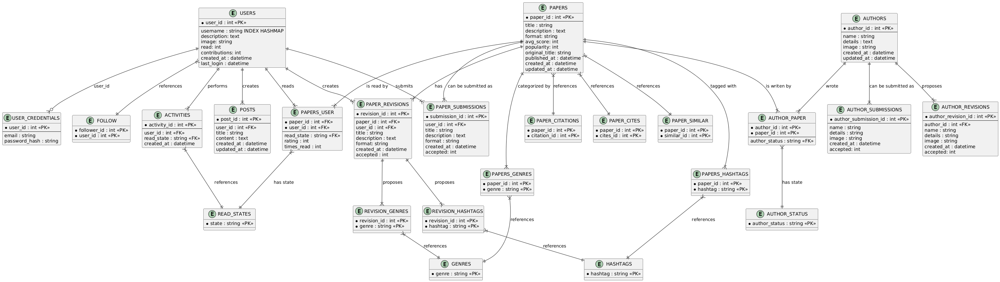

## Documentation for ScienceArch

#### Introduction
ScienceArch is web aplication, which will help users tract read scientific texts, search for new ones based on title or genres and rate them. It will also have a basic functionality to support community information exchange in form of posts, activity and user profiles. The idea is based on AniList, similar service used to search, trac and rate anime and manga.

Technologies used:
- Haskell
- MariaDB
- HTMX
- Nix

### Users
This application is mainly for students and scientific workers.

There are two types of users, normal users and admins. Admins will be able to delete posts and accecpt submissions of new texts into platform.

Users will be able to mark texts as read, reading or plan to read. Beside that, user can change his profile description and send posts. On top of that, users could follow eachother and submit new texts to the platform.

### Developer enviorment
The database used for this project is MariaDB. It is deployed using docker container. 

For project dependencies and build the nix is used. It is wide ecosystem, providing both biggest and latest package manager as well as developer enviorments and build system.

To enter developer enviorment and start database container:
```bash
# Enter nix shell - the developer enviorment
nix-shell --run bash

# Enable the docker daemon
sudo dockerd &

# Compose docker container
sudo docker-compose up -d

# Ensure it works
sudo docker-compose ps

# Enter the DB directly - for debug purpouses
sudo docker-compose exec db mariadb -u admin -p papers_db
```

Compile and run:
```bash
bash build.sh
```

### Functionalities
#### General
1. See home -> Activity + Posts + Reading

#### User related
1. Register as user
2. See profile
3. Login
4. Logout
5. List users
6. See profile of others
7. Follow user
8. Make post

#### User Paper
1. Submit paper - with genres
2. Resubmit paper - with genres
3. Read paper

#### User Author
1. Submit author
2. Resubtmi author
3. Author Paper

#### Admin
1. Accept submit paper
2. Accept submit author
3. Accept resubmit paper
4. Accept resubmit author

### Subsites
1. Home -> 20 latest activities or posts, 5 articles that user is reading, 
2. /users/<username> - same goes for seeing your profile
3. Your reading list -> /users/<username>/readlist
    - public for everyone
4. /browse -> Paper list(top 100 papers based on popularity)
5. /setting -> by default profile
    - /account -> username, email password, delete user
    - /profile -> description, image
6. /admin
    - /authorsubmitions
    - /authorresubmitions
    - /papersubmitions
    - /paperresubmitions
7. /login
8. /register


### The database
The diagram of the database:


#### Entities
I won't go into the details of entities, I belive that they have clear purpouse, which can be read from the UML diagram.

#### Triggers

• PAPER_SUBMISSION_INSERT_ADD_READ and PAPER_SUBMISSION_UPDATE_ADD_READ:  
  - These increment the user’s "read" count whenever they move a paper submission from “Plan to read” to another format.  
  - This will provide the sense of improvment when someone gets more READS, which number will be clearly shown on the profile.

• PAPER_SUBMISSION_ACCEPTED_ADD_CONTRIBUTION and PAPER_REVISION_ACCEPTED_ADD_CONTRIBUTION:  
  - Once a paper submission or revision is accepted, the user’s "contributions" are incremented.  
  - This could help to boost the activity of memmbers, since more internet points the better.

• AUTHOR_SUBMISSION_ACCEPTED_ADD_CONTRIBUTION and AUTHOR_REVISION_ACCEPTED_ADD_CONTRIBUTION:  
  - Similar logic as paper submissions
  - Whenever an author submission or revision is officially accepted, the contributions count is updated for that placeholder user.

• PAPERS_USER_INSERT_ACTIVITY and PAPERS_USER_UPDATE_ACTIVITY:  
  - These log a new row in ACTIVITIES whenever a user-paper relationship is created or changed.  
  - It’s a idea from Anilist

• POST_UPDATE_TIMESTAMP:  
  - Simple “before update” trigger that keeps the post’s "updated_at" timestamp current.

• PAPER_REVISION_ACCEPTED_UPDATE_PAPER:  
  - When a paper revision is accepted, any existing genres/hashtags for that paper are cleared and replaced by the revision’s genres/hashtags.  
  - This ensures the paper record reflects the latest accepted revision’s metadata.

• PAPER_DELETE_CLEAR_REFERENCES and USER_DELETE_CLEAR_REFERENCES:  
  - These clean up related records (e.g., in PAPERS_USER, ACTIVITIES, AUTHOR_PAPER, FOLLOW) when a paper or user is deleted.  
  - This helps me maintain referential integrity and avoid orphaned rows.

• AUTHOR_SUBMISSION_ACCEPTED_CREATE_AUTHOR and AUTHOR_REVISION_ACCEPTED_UPDATE_AUTHOR:  
  - After an author submission or revision is accepted, the AUTHORS table is either inserted or updated with the new data.  
  - This keeps author data consistent whenever an approval is finalized.


#### Normalization and Structure
- I aimed for a normalized design where each concept (Users, Papers, Authors, Submissions, Revisions, etc.) lives in its own table. This naturally avoids most update anomalies and keeps data structures clean.
- For instance, relationships like MANY-to-MANY between papers and genres/hashtags are handled by join tables (PAPERS_GENRES, PAPERS_HASHTAGS) instead of storing multiple genres/hashtags in a single field.  
- I introduced some intentional redundancies, especially in tracking user activities and in the separate PAPER_CITATIONS/PAPER_CITES structures. This allows for straightforward queries and better performance for certain workloads, even though it could theoretically be combined or deduplicated.  

Overall the normalization was done just in the flight and by later revision. Like I said, I mostly focused to group the concepts in one table, and relations also in tables.


### Future additions
1. Favourite papers
2. Citations of paper
3. Cited by 
4. Similar(recommended by user)
5. More info about user profile
6. Post activity comments
7. Likes to postst
